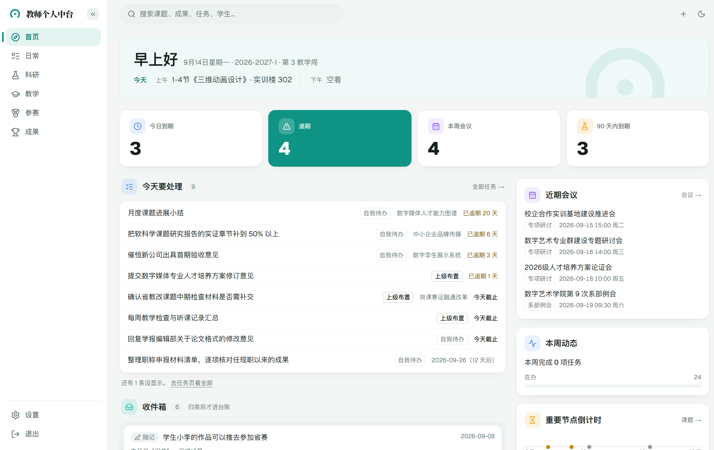
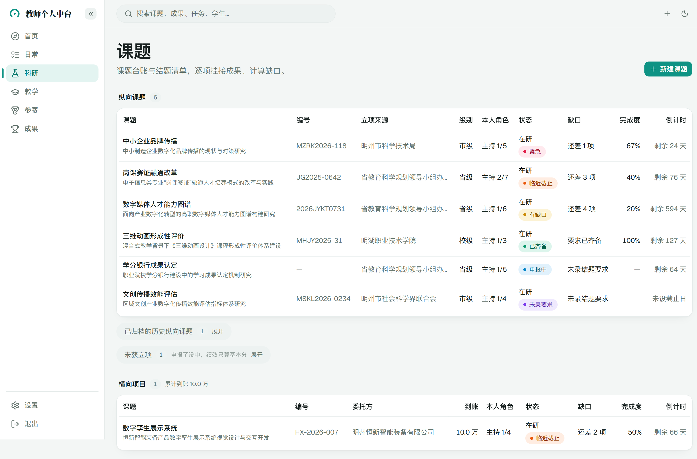
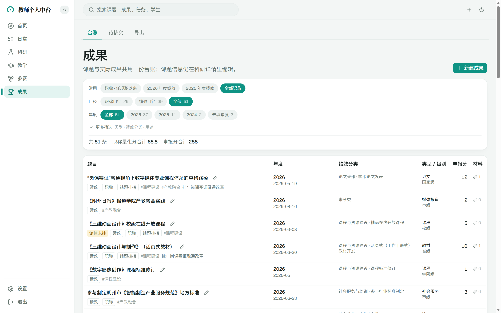
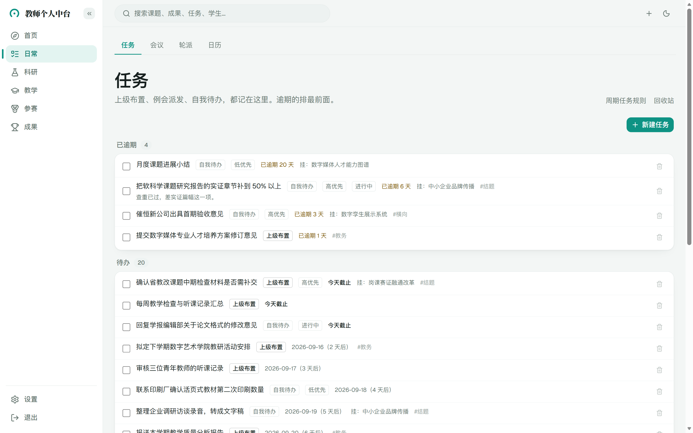
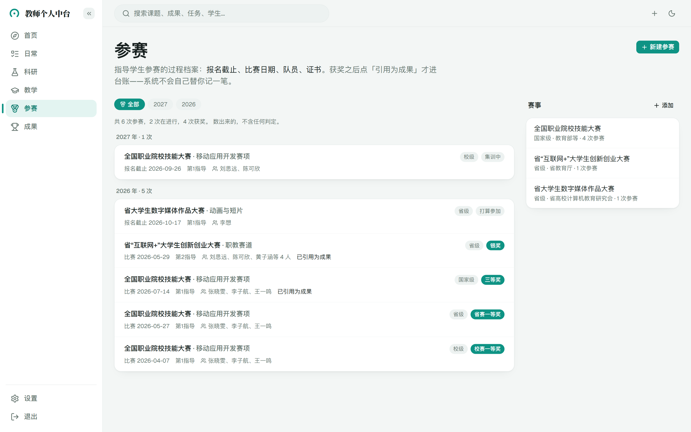

# 教师个人中台

给高校教师自己用的工作台：**平时把散落的东西沉淀进来，用时按场景取一份出去。**

课题、论文、教材、专利、获奖、会议、任务、课表……平时分散在各处。
到了结题验收、年度绩效填报、职称评审的时候，要从散落两三年的记录里，
按某一张表的口径把材料重新找一遍、裁一遍。这个系统做的就是这件事：
记录只存一份，按结题 / 绩效 / 职称不同的口径随时取出来。



> 截图里的课题、成果、人名、学校全部是虚构的演示数据。

## 能做什么

| 模块 | 干什么 |
|---|---|
| **首页** | 今天被哪几节课、哪几个会占着；逾期和今天到期的任务；随手记下的速记收件箱；课题结题倒计时 |
| **日常** | 任务（含周期任务、回收站）、会议与议题、轮派（监考、名额这类轮流分派）、月历 |
| **科研** | 课题台账。把结题要求拆成清单，挂接成果和材料，算出「还差什么」；结题材料一键打包、导出 Word 清单 |
| **成果** | 论文、专利、教材、获奖等成果台账。同一条成果可同时按绩效口径、职称口径归类；年度申报表导出 Excel |
| **教学** | 课表导入（首页和月历会用到）；可对接独立部署的备课系统 |
| **参赛** | 指导学生参赛的过程记录：报名截止、赛段晋级、获奖后引用为成果 |
| **班主任** | 名册、「谁没交」勾名单、学生荣誉、谈话记录（默认关闭，设置页开启） |

几条设计上的坚持：

- **系统只计算、不判定。** 某项成果算不算达标，由你自己勾选，系统不替你下结论
- **校验只提示、不拦截。** 格式不对会提醒，但永远不阻止你保存
- **模糊日期不硬转成精确日期。** 证书上只写了「2025年6月」，就按月存、按月显示
- **不需要的模块可以关掉。** 教学、轮派、参赛、班主任都能在设置页关闭，数据不会删除

| 科研：课题台账与缺口 | 成果：双口径台账 |
|---|---|
|  |  |
| **日常：任务** | **参赛：晋级路径与引用为成果** |
|  |  |

## 它不是什么

- **不是学校的管理系统。** 没有审批、没有多账号、没有权限分级。一个实例对应一位老师、一个登录口令
- **不是托管服务。** 需要你自己部署到自己的电脑或服务器上，数据留在你自己手里
- **不保证适配每所学校。** 绩效分类、职称量化表、教务系统的课表格式，每所学校都不一样，
  下面「按你们学校调整」一节说明了哪些需要自己动手

## 快速开始

在自己电脑上用 Docker 跑起来试试。

**需要**：[Docker Desktop](https://www.docker.com/products/docker-desktop/)（Windows 需要启用 WSL 2）、Git。

**1. 下载代码**

```bash
git clone https://github.com/Devilyuu/teacher-hub.git
cd teacher-hub
```

**2. 生成配置文件**

复制一份配置模板：

```bash
cp .env.example .env
```

Windows PowerShell 用 `Copy-Item .env.example .env`。

用记事本或任意编辑器打开 `.env`，改这三项：

| 配置项 | 填什么 |
|---|---|
| `APP_PASSCODE` | 你的登录口令，建议至少 8 位 |
| `APP_SESSION_SECRET` | 一串随机字符，32 位以上，随便敲一长串也行 |
| `POSTGRES_PASSWORD` | 数据库密码，随机字母数字即可，**不要包含 `@ : / ? #`** |

其余保持默认。`APP_DOMAIN` 默认是 `localhost`，本地试用不用改。

**3. 启动**

```bash
docker compose --profile full up -d --build
```

第一次要下载依赖并构建镜像，视网络情况需要几分钟到十几分钟，之后再启动就很快。

**4. 打开**

浏览器访问 <https://localhost>。本地用的是自签名证书，浏览器会提示「不安全」，
选择「继续访问」即可（只有第一次）。输入 `APP_PASSCODE` 登录。

刚启动时是一个空台账，从「科研 → 新建课题」或首页右上角的速记开始用。

**常见问题**

- **80 / 443 端口被占用**：在 `.env` 里加 `HTTP_PORT="8080"` 和 `HTTPS_PORT="8443"`，重新执行第 3 步，然后访问 <https://localhost:8443>
- **口令输对了却一直回到登录页**：确认访问的是 `https://`，不是 `http://`（登录状态只在 HTTPS 下保存）
- **停止 / 再次启动**：`docker compose --profile full stop` / `docker compose --profile full up -d`
- **数据存在哪**：项目目录下的 `data/`（数据库和附件都在里面）。删掉 `data/` 等于清空全部数据

## 部署到服务器

想在手机上也能随时打开，就放到云服务器上、配上自己的域名。
步骤、备份、升级都写在 [docs/deploy.md](docs/deploy.md)。

## 按你们学校调整

**时区。** 默认东八区（`TZ="Asia/Shanghai"`）。不在东八区的话一定要改，
「今天」「逾期」「倒计时」都按它算。

**绩效分类和职称量化表。** 每所学校的表都不一样，开源版不带任何学校的表，
没有它们也不影响课题、日常、教学等模块使用。要用成果台账的绩效 / 职称口径，
把你们学校的表整理成 JSON 导入。格式参照
[examples/performance-rules.example.json](examples/performance-rules.example.json)（二级学院的绩效积分表）和
[examples/promotion-rules.example.json](examples/promotion-rules.example.json)（人事处的职称量化考核表），
然后在开发环境（见下文）里导入。默认是试运行，只打印将要写入的内容，确认无误再加 `--apply`：

```bash
npm run import:perf-rules -- 你的文件.json
npm run import:promotion-rules -- 你的文件.json
```

表每年会改，换一个 `year` 再导一次即可，旧年度的表原样保留，历史成果仍按当年的表解释。

**课表导入。** 解析器按某一种教务系统导出的 `.xls` 课表格式编写（每格形如
`课程/(1-2节)10-13周/校区 教室/教师/…`），格式说明和测试样例在 `lib/timetable.ts`
与 `test/fixtures/`。你们学校的导出格式不同时，需要改这个解析器；也欢迎提 Issue，附上一份去掉个人信息的样例。

**可选的外部服务。** 会议录音转写（腾讯云）、会议纪要草稿（任意 OpenAI 兼容接口）默认不启用，
全部留空系统照常可用。启用后，每次上传录音都要你单独确认才会发送到外部服务。配置项见 `.env.example` 里的注释。

## 本地开发

改代码、导入规则表、灌演示数据时用这套。需要 Node.js 22 以上。

```bash
npm install
cp .env.example .env         # 同上，改口令、密钥、数据库密码
npm run db:up                # 只启动数据库容器（宿主机端口 15432）
npm run db:migrate           # 建表
npm run db:seed              # 写入几个通用的文档分类
npm run dev                  # http://localhost:3000
```

想先看看填满数据的样子，可以建一个独立的演示库，灌入一套完整的虚构数据（和上面的截图一样）：

```bash
cp .env.demo.example .env.demo   # 按文件里的说明填好
npm run demo:create-db
npm run demo:reset
npm run demo:dev
```

演示流程会清空目标库，所以脚本只接受名字里带 `demo` 的数据库。

常用检查：

| 命令 | 作用 |
|---|---|
| `npm test` | 单元测试 |
| `npm run typecheck` | 类型检查 |
| `npm run lint` | 代码规范 |
| `npm run test:e2e` | 浏览器端到端测试（会自动创建并清理一次性数据库） |

技术栈：Next.js（App Router）· TypeScript · PostgreSQL + Prisma · Tailwind CSS + shadcn/ui · Vitest · Playwright · Docker Compose + Caddy。

> 代码注释里偶尔会提到 `CLAUDE.md`、`PRD` 等设计文档，那些是作者私人开发过程中的文档，没有随开源版公开。

## 数据与隐私

- 全部数据存在你自己部署的数据库和 `data/` 目录里，不经过任何第三方
- 默认不向任何外部服务发送数据；转写、纪要草稿需要你主动配置，且每次上传都要确认
- 设置页可以随时导出一份全库 JSON 备份（不含附件原件），不依赖本系统也能读

## 反馈

使用和部署中遇到问题，欢迎在 [GitHub Issues](https://github.com/Devilyuu/teacher-hub/issues) 提出，方便后来的老师检索。
提交截图或样例文件前，请先去掉里面的个人信息。

## 许可证

[MIT](LICENSE)
